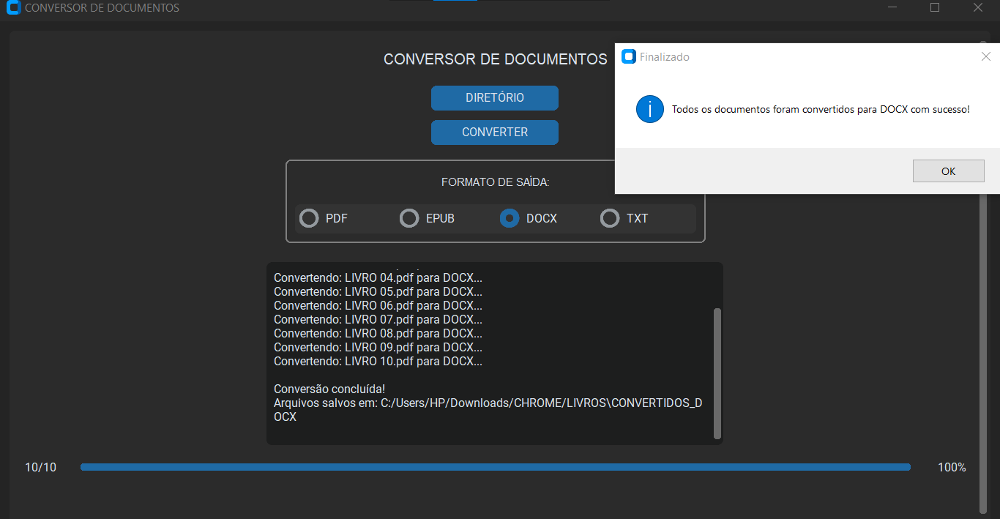
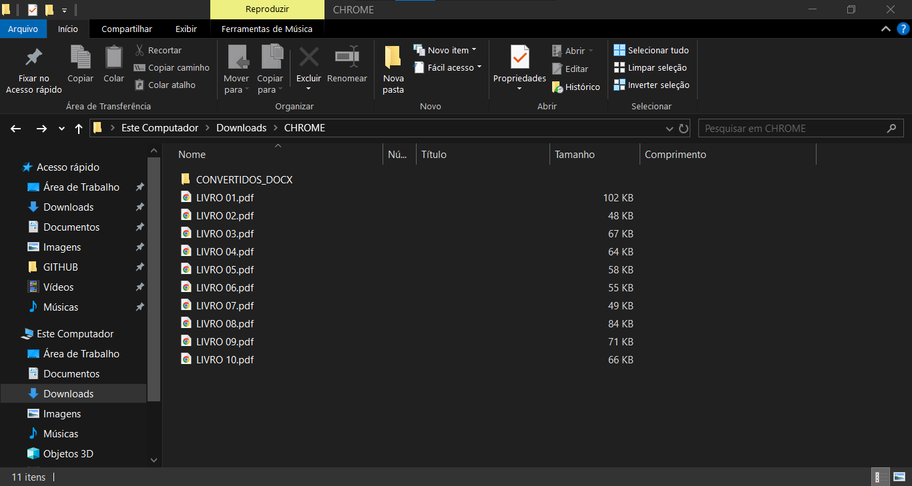
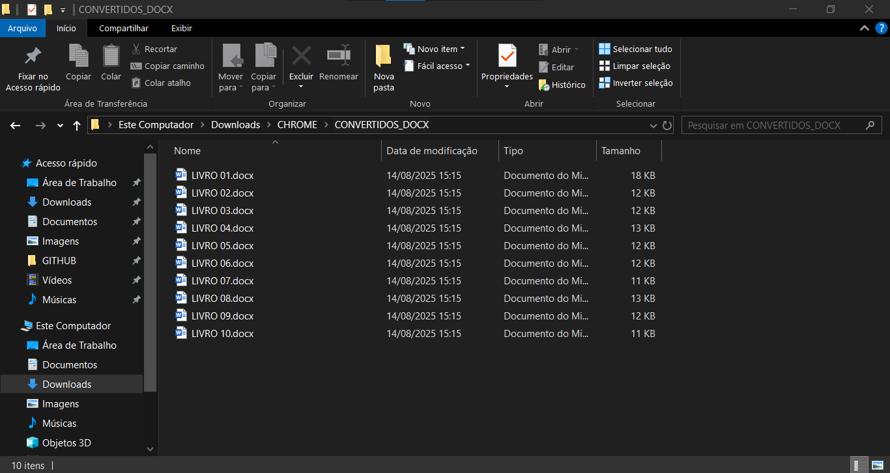

# DOCUMENTOS CONVERTER
👨‍🏫USE ESSE APLICATIVO PARA CONVERTER DOCUMENTOS PARA "PDF", "EPUB" "DOCX" E "TXT".

 <br>
 <br>
 <br>

## DESCRIÇÃO:
Este é um aplicativo desktop em **Python** com uma interface moderna feita com `customtkinter`, que permite ao usuário **converter arquivos de documentos** (como `.pdf`, `.docx`, `.txt`, etc.) para outros formatos (`.pdf`, `.epub`, `.docx`, `.txt`), utilizando a biblioteca `pypandoc` (que é um wrapper para o conversor de documentos Pandoc).

## FUNCIONALIDES:
* Criada com `customtkinter`, com rolagem, botões, rótulos e barra de progresso.
* Aparência em modo escuro.
* O usuário pode escolher uma pasta com arquivos de documentos que deseja converter.
* O programa reconhece automaticamente arquivos com as extensões:
  * `.docx`, `.txt`, `.md`, `.rtf`, `.odt`, `.html`, `.pdf`
* O usuário escolhe o formato de saída desejado:
  * `PDF`, `EPUB`, `DOCX`, `TXT`
* Todos os arquivos do diretório selecionado são convertidos para o formato escolhido.
* Mostra o andamento da conversão.
* Exibe mensagens sobre cada etapa da conversão.
* Criação automática de pasta de saída:
   * Exemplo: `CONVERTIDOS_TXT`, `CONVERTIDOS_PDF`, etc.

## EXECUTANDO ESSE PROJETO:
* 1. **Instale o Pandoc:**
   * O `pandoc` é a ferramenta principal usada para converter arquivos entre diversos formatos.
   * Siga os passos:

   1. Acesse: [https://pandoc.org/installing.html](https://pandoc.org/installing.html)
   2. Baixe e instale o Pandoc conforme seu sistema (Windows, macOS ou Linux).
   3. Certifique-se de que o comando `pandoc` funciona no terminal ou prompt (adicione ao `PATH` se necessário).

* 2. **Instale um motor LaTeX (obrigatório para conversão para PDF):**
   * O Pandoc precisa de um engine LaTeX para gerar arquivos PDF.
   * Recomendado:

      * **Para Windows:**

         * Instale o [**MiKTeX**](https://miktex.org/download):

         1. Baixe e instale o MiKTeX.
         2. Durante a instalação, marque a opção para permitir instalação de pacotes sob demanda.

      * **Para Linux:**

         ```bash
         sudo apt install texlive texlive-xetex
         ```

      * **Para macOS:**

         ```bash
         brew install --cask mactex
         ```

* 3. **Instale as dependências Python:**
   * Acesse o diretório do seu projeto (`CODIGO`) e execute:

   ```bash
   pip install -r requirements.txt
   ```

* 4. **Execute o aplicativo:**
   * No terminal, dentro do diretório do projeto, execute:

   ```bash
   python CODIGO.py
   ```

* 5. **Usando o Aplicativo:**
   1. Clique em **“DIRETÓRIO”** para escolher a pasta com os arquivos a converter.
   2. Selecione o **formato de saída** (PDF, EPUB, DOCX ou TXT).
   3. Clique em **“CONVERTER”**.
   4. Acompanhe o progresso na barra e na área de status.
   5. Os arquivos convertidos serão salvos automaticamente na subpasta:

   ```
   CONVERTIDOS_FORMATO
   ```

   dentro do diretório original.

## NÃO SABE?
- Entendemos que para manipular arquivos em muitas linguagens, é necessário possuir conhecimento nessas áreas. Para auxiliar nesse aprendizado, oferecemos cursos gratuitos disponíveis:
* [CURSO DE PYTHON](https://github.com/VILHALVA/CURSO-DE-PYTHON)
* [CURSO DE CUSTOMTKINTER](https://github.com/VILHALVA/CURSO-DE-CUSTOMTKINTER)
* [CONFIRA MAIS CURSOS](https://github.com/VILHALVA?tab=repositories&q=+topic:CURSO)

## CREDITOS:
- [PROJETO BASEADO NO "AUDIO CONVERTER"](https://github.com/VILHALVA/AUDIO-CONVERTER)


